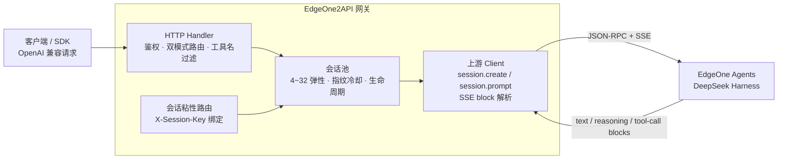

<h1 align="center">EdgeOne2API</h1>

<p align="center">
  <b>把 EdgeOne Agents（DeepSeek Harness）变成 OpenAI 兼容 API 的网关</b><br>
  纯文本模式 · 工具调用模式 · 工具名白名单 / 别名过滤 · 会话池 · 会话粘性 · 生命周期自愈 · 流式 / 非流式
</p>

<p align="center">
  
  
  
  
  
</p>

---

## 项目简介

EdgeOne2API 是一个自托管的 **OpenAI 兼容反向代理网关**，将 EdgeOne Agents / DeepSeek Harness（`deepseek-harness.edgeone.cool`）包装为统一的 `/v1/chat/completions` 服务。

- 上游是带 **agent loop** 的对话引擎，原生输出流式 block 事件（文本、推理、工具调用），且自带一套**平台原生工具**（`mcp__edgeone__*` / Codex 风格 `bash` / `str_replace_editor`）；
- 本网关负责两件事：**把 agent 协议翻译成 OpenAI 标准协议**，以及**保证工具只在客户端执行、上游沙箱永不介入**；
- 对客户端只暴露 OpenAI 兼容接口，现有 SDK / 前端 / 工具 **零改造接入**。

> ⚠️ 合规须知：本项目是**非官方**网关，使用 EdgeOne Agents 会话作为上游，**仅限本人授权账号、本机 / 私有环境测试**。详细边界见[安全与合规](#安全与合规)。

## 核心能力

| 能力 | 说明 |
|---|---|
| 🎭 **双模式** | 未声明 `tools` → **纯文本模式**：折叠上游一切工具事件、`finish_reason` 归一为 `stop`、工具驱动的轮次自动续读直到输出正文；声明 `tools` → **工具调用模式**：解析上游原生 tool-call block（或 ToolForge JSON 文本协议），返回标准 `tool_calls` |
| 🛡️ **工具名白名单 + 别名过滤** | 上游漂移出的 `bash` / `str_replace_editor` / `mcp__edgeone__*` 等名字，在到达客户端前被校验 / 改写 / 丢弃——杜绝「客户端报 Tool not found → 模型编造沙箱被挡」的故障链 |
| 🧲 **会话池** | `pool_min` ~ `pool_max` 弹性伸缩（默认 4~32），空闲自动回补、突发并发预热（最多 4 个并行在途）、浏览器指纹限流后 24h 冷却 |
| 📎 **会话粘性** | 客户端带 `X-Session-Key` 即绑定固定上游会话，多轮对话上下文连续；达 `max_req_per_session` 或连续失败自动轮换 |
| 💊 **生命周期自愈** | 上游约 20 分钟回收空闲会话——`session not found` 被识别为**生命周期事件**（`MarkGone`）而非配额事件，换新会话重试，不烧指纹、不 502；真实配额错误（`IsQuotaError`）才冷却指纹 24h |
| 🔒 **沙箱隔离** | SSE 流在 turn 结束时立即 cancel，上游 agent loop（沙箱工具执行）在启动前即被掐断——工具永远跑在客户端，不在沙箱 |
| ⚡ **流式 + 非流式** | SSE 透传 / 折叠 / 续读；非流式由本地聚合为单响应 |
| 🧠 **推理强度** | 支持 `reasoning_effort`（`off` / `high` / `max`），全局兜底 `default_reasoning_effort`，模型映射可逐模型指定 |
| 📊 **可观测** | `/healthz` 探活、`/pool` 会话池状态（free / bound / 冷却 / 命中率）、每请求 `[TOOLS]` 过滤日志 |
| 🔑 **可选鉴权** | 配置 `api_key` 后需 Bearer token；空 = 不鉴权 |

## 架构总览



上游事件在网关侧经历统一处理管线（`internal/upstream/client.go`）：block 事件解析（`text-delta` / `reasoning-delta` / `block-start` / `tool-call-delta` / `block-end`）、textOnly 折叠与续读、turn 结束即 cancel；工具调用结果再经 `internal/server/toolfilter.go` 白名单 / 别名过滤后才返回客户端。

## 快速开始

### 环境要求

- **Docker + Docker Compose**（推荐部署方式）或宿主机 Go ≥ 1.22
- 一个可访问 `deepseek-harness.edgeone.cool` 的网络环境

### Docker Compose 一键部署

```bash
git clone https://github.com/lwjlwjlwjlwj/edgeone2api.git
cd edgeone2api
cp config.example.json config.json
```

编辑 `config.json`，**至少确认 `upstream_url` 与 `models`**；`api_key` 留空 = 不鉴权（公网部署务必设置）。

```bash
# 启动服务
docker compose up -d --build

# 健康检查（预热完成后返回池状态）
curl -s http://localhost:7863/healthz
# {"poolSize":4,"status":"ok"}
```

### 源码构建

```bash
go build ./...
go vet ./...
go test ./...      # 完整测试套件
go run ./cmd/server -config config.json
```

### 验证

```bash
# 模型列表
curl -s http://localhost:7863/v1/models -H "Authorization: Bearer your-api-key"

# 会话池状态（free/bound/total、指纹冷却、对话缓存命中率）
curl -s http://localhost:7863/pool -H "Authorization: Bearer your-api-key"

# 流式聊天
curl -sN http://localhost:7863/v1/chat/completions \
  -H "Authorization: Bearer your-api-key" \
  -H "Content-Type: application/json" \
  -d '{"model":"@makers/deepseek-v4-flash","messages":[{"role":"user","content":"你好"}],"stream":true}'

# 工具调用（返回 finish_reason="tool_calls" 与标准 tool_calls，由客户端执行）
curl -s http://localhost:7863/v1/chat/completions \
  -H "Authorization: Bearer your-api-key" \
  -H "Content-Type: application/json" \
  -d '{"model":"@makers/deepseek-v4-flash","messages":[{"role":"user","content":"杭州天气怎么样？"}],
       "tools":[{"type":"function","function":{"name":"get_weather","description":"查询天气",
         "parameters":{"type":"object","properties":{"city":{"type":"string"}}}}}]}'
```

## 配置说明

**`config.example.json` 是配置项最完整的参考**：每个字段、默认值与结构都能在其中找到。下表为字段含义速查。

### 字段速查

| 字段 | 默认 | 说明 |
|---|---|---|
| `listen` | `:7863` | HTTP 监听地址 |
| `api_key` | 空 | 网关鉴权密钥；**空 = 不鉴权直接放行**（公网必须设置） |
| `models` | 见示例 | 对外暴露的模型列表（`/v1/models` 返回） |
| `pool_min` / `pool_max` | `2` / `8` | 会话池弹性范围（示例与部署常用 `4` / `32`） |
| `ttl_minutes` | `0` | 会话 TTL（0 = 不过期，仅失败或达上限时回收） |
| `free_ttl_minutes` | `90` | 空闲会话回收上限（上游约 1.5-2h 销毁空闲会话，早于它回收避免僵尸会话） |
| `bind_ttl_minutes` | `30` | 绑定会话（会话连续性）空闲超时 |
| `max_req_per_session` | `200` | 单会话最大请求数，超出自动轮换 |
| `upstream_url` | `https://deepseek-harness.edgeone.cool` | 上游 Harness 地址 |
| `agent_preset` | `minimal` | 上游会话预设（`minimal`/`makers`/`standard`/`code`/`cordis`） |
| `request_timeout_seconds` | `600` | 非流式整体超时（流式无总时长上限） |
| `stream_idle_seconds` | `180` | 流式：无上游事件 N 秒判定死连接（0 = 禁用） |
| `default_reasoning_effort` | `off` | 全局推理强度兜底（`off`/`high`/`max`/空），客户端与 model_map 均未指定时生效 |
| `request_jitter_ms` | `0` | 发送前随机延迟 `[0,N)`，伪并发防抖 |
| `max_concurrent` | `0` | 并发上游请求上限（0 = 不限） |
| `model_map` | 见示例 | 模型名 → 上游 provider/model 映射，可带每模型 `reasoning_effort` |

### 环境变量覆盖

加载顺序：JSON 文件 → `EDGEONE_API_*` 环境变量（变量非空才覆盖）：

`EDGEONE_API_LISTEN` · `EDGEONE_API_KEY` · `EDGEONE_API_MODELS` · `EDGEONE_API_POOL_MIN` · `EDGEONE_API_POOL_MAX` · `EDGEONE_API_TTL_MINUTES` · `EDGEONE_API_BIND_TTL_MINUTES` · `EDGEONE_API_MAX_REQ_PER_SESSION` · `EDGEONE_API_UPSTREAM`

无需配置文件也可运行：

```bash
EDGEONE_API_LISTEN=:7863 EDGEONE_API_POOL_MIN=4 EDGEONE_API_POOL_MAX=32 ./edgeone2api
```

### 可用模型

`model_map` 将客户端请求的模型名映射到上游 provider/model，客户端可选传 `reasoning_effort`（`off`/`high`/`max`），或由映射默认指定。

| 模型 | provider | 推理强度 |
|---|---|---|
| `@makers/deepseek-v4-flash` | edgeone-makers | off / high / max |
| `@makers/deepseek-v4-pro` | edgeone-makers | off / high / max |
| `@makers/hy3` / `@makers/hy3-preview` | edgeone-makers | 无 |
| `@makers/minimax-m3` / `@makers/minimax-m2.7` | edgeone-makers | 无 |
| `@makers/kimi-k2.6` | edgeone-makers | 无 |

> `deepseek-official` provider 的模型需要额外的上游凭证，默认不可用，已从默认 `model_map` 排除。

## 核心行为语义

### 双模式路由

客户端是否声明 `tools` 决定走哪条路：

| 模式 | 触发条件 | 行为 |
|---|---|---|
| **纯文本模式**（textOnly） | 请求不带 `tools` | 上游 tool-call block 事件在客户端流中**折叠丢弃**（日志 `textOnly: dropping tool-call block`）；工具驱动的轮次**不会终止对话**——`turn/end` 时若本轮只有被丢弃的工具调用，自动续读后续轮次直到模型输出真正正文；`finish_reason` 统一归一为 `stop`。效果：永远得到一段完整纯文本回答，不白屏、不空回复 |
| **工具调用模式** | 请求带 `tools` | ① 原生通道：上游发 tool-call block（`block-start` → `tool-call-delta` → `block-end`），网关流式拼装为标准 `tool_calls`；② 文本协议通道（ToolForge fallback）：模型以纯文本 JSON `{"tool_calls":[...]}` 声明时，网关解析并补发结构化 `tool_calls` delta。两通道都经过工具名过滤层 |

### 工具名过滤（tool filter）

上游模型可能输出**它自己平台的原生工具名**（Codex/EdgeOne 风格的 `bash`、`str_replace_editor`、`mcp__edgeone__*`），而客户端声明的是 `exec`、`read` 等。网关在返回前做一层过滤（`internal/server/toolfilter.go`）：

| 类别 | 处理 |
|---|---|
| 客户端已声明的名字 | 原样透传 |
| 别名表命中（`bash/shell/sh/zsh/python/python3→exec`、`str_replace_editor/text_editor/read_file→read`、`write_file→write`、`glob/grep/code_search→exec`） | 改写为目标名（**仅当目标名被客户端声明才生效**） |
| `mcp__edgeone__*` / `edgeone__*` / `workspace_run_command` 等平台能力 | 一律丢弃，绝不透传、绝不别名 |
| 其余未知名 | 丢弃 + 日志 `[TOOLS] filter: drop tool "X"` |

- 白名单**每请求动态构建**自客户端 `tools` 声明，零维护；
- 别名表加新映射只需补一行（`internal/server/toolfilter.go` 的 `upstreamAliases`）；
- 流式路径按 index 追踪已丢弃调用，后续参数增量一并抑制；全部调用被过滤时 `finish_reason` 从 `tool_calls` 归一为 `stop`，客户端不会收到「有 finish 无数据」。

> 为什么要有这层过滤：没有它，上游漂移名会被原样透传给客户端 → 客户端回 `Tool not found` → 模型据此**编造**「沙箱策略挡住执行」的叙事并甩脚本给用户。过滤层从源头消灭这条故障链。

### 会话生命周期

| 事件 | 判定 | 处置 |
|---|---|---|
| `session not found` | 生命周期事件（上游约 20 分钟回收空闲会话） | `MarkGone()`：强制回收该会话、**不烧指纹**，换新会话透明重试 |
| 配额错误（`IsQuotaError`） | 真实配额事件 | `MarkQuotaExceeded()`：该浏览器指纹**冷却 24h**，不再参与会话创建 |
| 绑定会话锁竞争 | 并发同 key 请求 | CAS 门控 + `active` 标志的 `tryLock()`，杜绝 mutex 永不释放导致的请求挂死 |

`/pool` 端点可实时观察：`free` / `bound` / `exhausted_fps`（冷却指纹数）/ `dialog_hit_rate`（对话缓存命中率，多轮上下文复用收益）。

### 沙箱隔离原理

1. **预防半**：系统指令（`BuildDirective`）明确告知模型——「EdgeOne 沙箱与 `mcp__edgeone__*` 是平台自身运行时，**不是用户的机器**；需要工具时以 tool_calls 请求调用方执行」；
2. **执行半**：`defer cs.Cancel()` 在 SSE 流 turn 结束瞬间掐断上游，agent loop（沙箱工具执行）在启动前即被终止；
3. **兜底半**：即使模型仍发出平台工具名，`toolfilter` 也会拦截。

## API 端点

### 服务端点

| 端点 | 鉴权 | 说明 |
|---|---|---|
| `POST /v1/chat/completions` | Bearer（`api_key` 非空时） | OpenAI 兼容补全；流式 / 非流式；双模式路由 |
| `GET /v1/models` | Bearer（`api_key` 非空时） | 模型列表（配置的 `models`） |
| `GET /pool` | Bearer（`api_key` 非空时） | 会话池状态：free / bound / total、指纹冷却、对话缓存命中率 |
| `GET /healthz` | 无 | 健康检查：`{"poolSize":4,"status":"ok"}` |

> 鉴权规则：仅当 `api_key` 非空才校验 `Authorization: Bearer <api_key>`；`api_key` 为空时上述端点直接放行；`/healthz` 恒无鉴权。

### 会话粘性

同一会话尽量复用同一上游会话，多轮对话上下文连续：

- 请求带 `X-Session-Key: <任意字符串>` 即绑定固定会话；同一 key 后续请求共享上下文
- 未带 key 则从池中取空闲会话
- 会话达 `max_req_per_session` 或连续失败自动轮换为全新会话（`X-Session-Key` 响应头回显当前绑定）

### 流式行为细节

- 上游 block 事件按规范**白名单重建**为 OpenAI SSE 帧：`text-delta` → `content`、`reasoning-delta` → `reasoning_content`、tool-call block → `tool_calls`（按 index 合并，`block-end` 为权威参数）
- textOnly 模式：工具事件折叠、`finish_reason` 归一 `stop`、工具轮次自动续读
- 工具调用模式：原生 block 通道 + ToolForge JSON 文本协议 fallback 双通道，均过过滤层

### 上游端点

上游为 EdgeOne Agents / DeepSeek Harness 的**非公开 / 逆向接口**，路径以代码内常量为准：

| 相对路径 | 方法 | 用途 |
|---|---|---|
| `/api/session.create` | POST | 创建会话（支持 `agentPreset`） |
| `/api/session.prompt` | POST | 发送提示（`mode: "steer"\|"queue"`） |
| `/api/session.selectModel` | POST | 选择模型 |
| SSE event stream | GET | 流式 block 事件（text / reasoning / tool-call） |

## 部署运维

### Docker 镜像

多阶段镜像（构建 → alpine 运行时），无外部依赖。生产用挂载卷覆盖 `/app/config.json`。

```bash
docker build -t edgeone2api .
docker run -d --name edgeone2api --network host \
  -v "$PWD/config.json:/app/config.json:ro" \
  -e EDGEONE_API_LISTEN=:7863 \
  edgeone2api
```

或 `docker compose up -d --build`（端口映射与配置见 `docker-compose.yml`）。

### 验证脚本

验证不依赖 mock——直接请求真实上游（`@makers/deepseek-v4-flash`）：

```bash
python3 scripts/gen_demo_data.py   # 生成演示数据到 /tmp/kuku2api_demo/
python3 scripts/verify_longctx.py  # 长上下文 + 多轮会话连续性
python3 scripts/verify_tools.py    # 工具调用矩阵（非流式/流式/多轮链式闭环/名字翻译/纯文本防泄漏）
```

## 安全与合规

### 1. 凭据管理

- `api_key` 明文存于 `config.json`（或环境变量）；**切勿提交 git**——`.gitignore` 已排除 `config.json` / `deploy.config.json` 等
- 本项目无内置 TLS；公网部署必须设置 `api_key`，建议前置反代 / 内网

### 2. 日志敏感度

- 日志字段：会话 key、工具名、过滤行为——**不含** `api_key` / 上游凭证明文
- 日志写 **stdout / stderr**（容器内 `docker logs`），无落盘日志文件

### 3. 合规边界

- 上游 EdgeOne Agents 属商业平台，本项目是其**非官方 OpenAI 兼容网关**；使用其会话做 API 网关涉及目标平台服务条款与账号风险，作者不对账号封禁、条款违约或使用结果负责
- 仅限**本人授权账号**、本机 / 私有环境测试；不得共享、转售、违规分发

## 常见问题

### 模型说「执行通道被沙箱策略挡了」怎么办？

这是**幻觉**（通常由工具名漂移触发）：模型引用的报错原文（如 `sandbox mode workspace-write`）在本项目与客户端代码中均不存在，且同会话 `exec` 往往已成功返回真实数据。根因是模型混淆了三套工具名（客户端声明的 `exec/read`、平台原生 `mcp__edgeone__*`、臆造的 `bash/str_replace_editor`），网关旧版直接透传导致客户端回 `Tool not found`。

**当前版本已根治**：`toolfilter` 白名单 / 别名 / 丢弃三层处理 + 指令明确「沙箱是平台运行时，不是你的机器」。若仍复现，检查日志 `[TOOLS] filter: drop tool "X"`——出现即表示需要补别名映射。

### 上游会话被回收导致 502？

当前版本已把 `session not found` 判定为**生命周期事件**（`MarkGone`）：换新会话透明重试，不烧指纹、不 502。若仍见 502，查看日志是否 `fingerprint exhausted` / `cooling down`（真实配额问题，冷却 24h 自动恢复）。

### 如何换模型或加模型？

编辑 `config.json` 的 `model_map` 增加映射（provider/model/reasoning_effort），并同步 `models` 列表；`/v1/models` 即刻生效。

### 纯文本请求偶尔空回复 / 白屏？

textOnly 模式已保证「工具轮次自动续读直到正文」+ `finish_reason` 归一 `stop`。若仍异常，检查 `stream_idle_seconds` 是否过小（默认 180s，上游长思考时可能被误判死连接）。

## 关键断言 ↔ 代码出处

| 断言 | 出处 |
|---|---|
| 双模式路由（textOnly = 无 tools） | `internal/server/server.go:329-330` |
| textOnly 折叠 / 续读 / 归一 | `internal/upstream/client.go:532`、`StreamEvents` |
| 工具名白名单 + 别名 + 禁止前缀 | `internal/server/toolfilter.go`（`newToolFilter` / `resolve`） |
| 平台工具 `mcp__edgeone__*` 一律丢弃 | `internal/server/toolfilter.go`（`forbiddenPrefixes`） |
| 全过滤时 `finish_reason` 归一 stop | `internal/server/server.go`（`emittedToolCall` 跟踪） |
| `session not found` = 生命周期（MarkGone） | `internal/server/server.go`（`IsSessionNotFound` 分支）、`internal/auth/pool.go` |
| 配额错误冷却指纹 24h | `internal/auth/pool.go`（`MarkQuotaExceeded` / `exhaustFingerprint`） |
| 绑定锁 CAS + active 防泄漏 | `internal/auth/pool.go`（`tryLock`） |
| turn 结束 cancel 掐断沙箱 | `internal/server/server.go`（`defer cs.Cancel()`） |
| SSE block 事件解析 | `internal/upstream/client.go`（`block-start` / `tool-call-delta` / `block-end`） |
| ToolForge JSON 文本协议 fallback | `internal/server/server.go`（`parseToolCalls` / `emitToolCallsSSE`） |
| 上游 RPC 端点 | `internal/upstream/client.go`（`session.create` / `session.prompt` / `session.selectModel`） |

## 免责声明

本项目仅供学习和研究使用。使用者需遵守 EdgeOne Agents / DeepSeek Harness 服务条款，自行承担使用风险（包括账号封禁、条款违约等）。作者不对任何因使用本项目产生的直接或间接损失负责。

## License

本项目采用 [MIT License](LICENSE) 开源协议。

- 允许任意使用、复制、修改、合并、发布、分发、再授权及销售
- 再分发（源码或二进制形式）时，请保留原仓库的 MIT 版权声明与许可声明（如在 NOTICE 或 README 中注明原始出处 `https://github.com/lwjlwjlwjlwj/edgeone2api`）
- 本项目不授予任何上游（EdgeOne / DeepSeek Harness）接口或服务的权利；使用者仍需自行遵守上游服务条款
