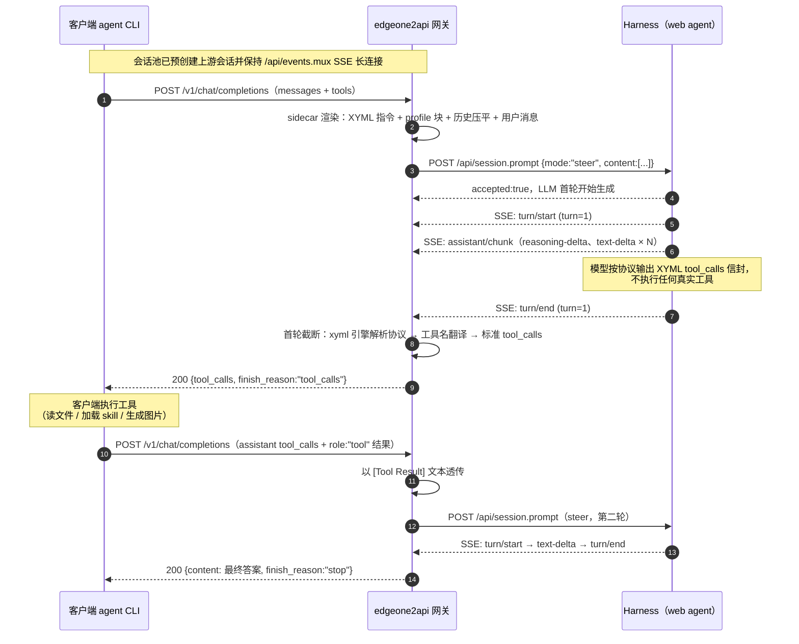

# edgeone2api

> EdgeOne Makers Agent 的 OpenAI 兼容 API 网关，Go 实现。

逆向自 EdgeOne Makers / DeepSeek Harness Web Chat 的 `session.prompt` RPC 接口，将其封装为标准 OpenAI 兼容 `/v1/chat/completions` 端点，支持 SSE 流式输出，免登录即可调用 Makers Agent 托管的 DeepSeek 系列模型。

网关对上游的定位是「伪装成浏览器用户的纯文本 LLM 端口」：web agent 的多轮工具循环被指令压制，工具调用改为「首轮 JSON 文本声明 → 网关解析 → 客户端真实执行」的 ToolForge 风格闭环。

## 功能特性

- **免登录** — 直接调用 Harness 的 `session.create` / `session.prompt` RPC，无需登录即可使用
- **多模型支持** — `@makers/deepseek-v4-flash`、`@makers/deepseek-v4-pro`、`@makers/kimi-k2.6`、`@makers/hy3`、`@makers/minimax-m3` 等（通过 `model_map` 配置）
- **推理强度可调** — 支持 OpenAI 标准 `reasoning_effort` 参数（`off`/`high`/`max`）
- **浏览器指纹隔离** — 每个会话独立 UA/Sec-CH-UA 指纹，上游将每个会话视为独立浏览器，限流互不影响
- **弹性凭证池** — 会话池自动创建/复用/维护，配额感知轮换（绕过单一会话的用量上限）；会话不足时并发后台扩容，突发请求不排队
- **SSE 流式** — 流式透传上游事件流（文本/推理/工具调用 delta），非流式自动聚合 `content`
- **工具调用** — 原生支持 OpenAI `tools` 参数：完整移植 toolforge 的 XYML 受控标记协议引擎（`refactor/xyml-package`），客户端声明的工具定义经 sidecar 生成协议指令，模型首轮即以 `<|XYML|tool_calls>` 协议声明工具调用，网关以同一引擎强校验解析为标准 `tool_calls`（ToolForge 风格，首轮截断，一次 LLM 调用即可闭环）；`role:"tool"` 结果回传后自然续接
- **可选鉴权** — 配置 `api_key` 后需 Bearer token 访问
- **Go 单二进制** — 无外部依赖，`go build` 即得

## 快速开始

### 1. 构建 & 配置

```bash
go build -o edgeone2api ./cmd/server
cp config.example.json config.json
# 编辑 config.json，设置 api_key（可留空 = 不鉴权）、model_map 等
```

### 2. 启动服务

```bash
./edgeone2api -config config.json
```

或直接用环境变量（无需配置文件）：

```bash
EDGEONE_API_LISTEN=:7863 EDGEONE_API_POOL_MIN=4 EDGEONE_API_POOL_MAX=32 ./edgeone2api
```

### 3. 验证

```bash
# 健康检查
curl -s http://localhost:7863/healthz

# 模型列表
curl -s http://localhost:7863/v1/models -H "Authorization: Bearer your-api-key"

# 聊天（非流式）
curl -s http://localhost:7863/v1/chat/completions \
  -H "Authorization: Bearer your-api-key" \
  -H "Content-Type: application/json" \
  -d '{"model":"@makers/deepseek-v4-flash","messages":[{"role":"user","content":"你好"}]}'

# 聊天（流式）
curl -N http://localhost:7863/v1/chat/completions \
  -H "Authorization: Bearer your-api-key" \
  -H "Content-Type: application/json" \
  -d '{"model":"@makers/deepseek-v4-flash","stream":true,"messages":[{"role":"user","content":"数到3"}]}'

# 鉴权可省略（api_key 为空时）；会话池状态
curl -s http://localhost:7863/pool
```

## 配置说明

```json
{
  "listen": ":7863",
  "api_key": "",
  "models": ["@makers/deepseek-v4-flash", "@makers/deepseek-v4-pro"],
  "pool_min": 4,
  "pool_max": 32,
  "ttl_minutes": 0,
  "bind_ttl_minutes": 30,
  "max_req_per_session": 200,
  "upstream_url": "https://deepseek-harness.edgeone.cool",
  "agent_preset": "minimal",
  "model_map": {
    "@makers/deepseek-v4-flash": {"provider": "edgeone-makers", "model": "@makers/deepseek-v4-flash"}
  }
}
```

| 字段 | 环境变量 | 默认值 | 说明 |
|---|---|---|---|
| `listen` | `EDGEONE_API_LISTEN` | `:7863` | 监听地址 |
| `api_key` | `EDGEONE_API_KEY` | 空 | API 鉴权 key（空=不鉴权） |
| `models` | `EDGEONE_API_MODELS` | `[flash, pro]` | 支持的模型列表（`/v1/models` 返回） |
| `pool_min` | `EDGEONE_API_POOL_MIN` | `4` | 会话池最小会话数 |
| `pool_max` | `EDGEONE_API_POOL_MAX` | `32` | 会话池最大会话数（并发上限） |
| `ttl_minutes` | `EDGEONE_API_TTL_MINUTES` | `0` | 会话最长生命周期（分钟，`0`=无限制，仅失败或达上限时回收） |
| `bind_ttl_minutes` | `EDGEONE_API_BIND_TTL_MINUTES` | `30` | 绑定会话（会话连续性）空闲超时（分钟） |
| `max_req_per_session` | `EDGEONE_API_MAX_REQ_PER_SESSION` | `200` | 单会话最大请求数，超出后自动轮换 |
| `upstream_url` | `EDGEONE_API_UPSTREAM` | `https://deepseek-harness.edgeone.cool` | 上游 Harness 地址 |
| `agent_preset` | — | `minimal` | agent 预设（`minimal`/`makers`/`standard`/`code`/`cordis`） |

### 模型与推理强度

`model_map` 将客户端请求的模型名映射到上游 provider/model。客户端可选传 `reasoning_effort`
（`off`/`high`/`max`），或由映射默认指定。会话级缓存避免重复调用 selectModel。

```bash
curl -s http://localhost:7863/v1/chat/completions \
  -H "Content-Type: application/json" \
  -d '{"model":"@makers/deepseek-v4-flash","reasoning_effort":"high","messages":[{"role":"user","content":"9.11和9.8哪个大？"}]}'
```

可用模型目录（`session.models` 实测）：

| 模型 | provider | 推理强度 |
|---|---|---|
| `@makers/deepseek-v4-flash` | edgeone-makers | off / high / max |
| `@makers/deepseek-v4-pro` | edgeone-makers | off / high / max |
| `@makers/hy3` / `@makers/hy3-preview` | edgeone-makers | 无 |
| `@makers/minimax-m3` / `@makers/minimax-m2.7` | edgeone-makers | 无 |
| `@makers/kimi-k2.6` | edgeone-makers | 无 |

> `deepseek-official` provider 的模型（如 `deepseek-v4-pro`）需要设置 `EDGEONE_API_KEY`
> （通过 Harness 的 credentials 服务），默认不可用，已从默认 `model_map` 中排除。

## API

### `POST /v1/chat/completions`

OpenAI 兼容。支持 `stream`（SSE）、`max_tokens`、`temperature`、`top_p`、`reasoning_effort`、`tools`（见下方「工具调用」）。

### `GET /v1/models`

返回配置的模型列表。

### `GET /pool`

查看会话池状态（free/bound/total、配额轮换计数）。

### `GET /healthz`

健康检查。

## 会话连续性

通过 `X-Session-Key` 请求头关联会话，同一 key 的请求复用同一上游会话（保留对话上下文）。

- **提供 `X-Session-Key`**：绑定会话（`Bind`），该 key 持续复用同一会话，历史缓存自动重放；空闲超过 `bind_ttl_minutes` 或达到 `max_req_per_session` 后轮换
- **不提供**：匿名无状态请求，从空闲池临时取会话（`Acquire`/`Release`），用完即归还、不保留上下文；响应头会回传本次使用的 `X-Session-Key`，客户端带上它即可继续同一对话

会话达到 `max_req_per_session` 或连续失败后自动轮换为全新会话，被限流的指纹进入 24h 冷却。

## 工具调用（ToolForge 风格，首轮截断）

网关原生支持 OpenAI `tools` 参数。核心思路：**上游 Harness 只当纯文本 LLM 用**（`minimal` preset），
客户端声明的工具定义以受控标记协议（XYML/QNML）形式注入系统指令；模型**从不真实执行工具**——
它只用首轮协议文本「声明」要调用哪个客户端工具，网关解析、强校验后返回标准 `tool_calls`，
工具的真实执行完全发生在客户端侧（agent CLI 用自己的实现执行，包括加载 skill）。

工具解析引擎完整移植自 [toolforge `refactor/xyml-package` 分支](https://github.com/lwjlwjlwjlwj/toolforge/tree/refactor/xyml-package)：
`internal/toolcall/` 内嵌 Python sidecar（`xyml` 解析引擎 + `fc` 策略层 + `models` 规范层），
网关启动时自动拉起并健康检查（失败快速退出），所有协议渲染/解析/恢复都委托给它——不再维护
任何 Go 侧 JSON 修补逻辑。

```bash
curl -s http://localhost:7863/v1/chat/completions \
  -H "Content-Type: application/json" \
  -d '{
    "model": "@makers/deepseek-v4-flash",
    "messages": [{"role": "user", "content": "读取 /etc/hostname 的内容"}],
    "tools": [{"type": "function", "function": {"name": "read_file", "description": "读取文件", "parameters": {"type": "object", "properties": {"path": {"type": "string"}}, "required": ["path"]}}}]
  }'
```

### 工作原理

1. 客户端请求带 `tools`：sidecar 依据 `fc` 策略层生成 XYML 指令块（`<|XYML|tool_calls>` +
   `<|XYML|invoke name="...">` + `<|XYML|parameter name="...">`，字符串以 `<![CDATA[ ... ]]>`
   包裹，天然规避 JSON 转义地狱），并叠加检测到的 CLI 工具风格 profile 提示块；完整历史
   （含 assistant `tool_calls` / `role:"tool"` 结果）经 `render_history` 压平成纯文本，上游只见到
   普通聊天文本（`buildItems`，见 `internal/server/server.go`）
2. 上游首轮输出即协议信封；网关以 `streamSieve` 实时分流：普通散文直接流给客户端，疑似协议
   内容暂存到回合结束，由 sidecar 的 xyml 引擎解析为标准 `tool_calls`（`finish_reason: "tool_calls"`）
3. 若输出被截断或解析失败，sidecar 恢复层（`recovery`）判定原因并发起**单次纠错回合**重新输出；
   `role:"tool"` 结果回传后以 `[Tool Result]` 文本透传，模型下一回合自然续接给出最终答案
   （`finish_reason: "stop"`）

### 实测行为

- **名字翻译**：模型输出上游原生名时（`mcp__edgeone__workspace_run_command`、`u_exec`、
  `bash`/`read`/`glob` 等），翻译层（`translateToolCalls`，见 `internal/server/tools.go`）先剥离
  `mcp__`/`u_` 等前缀做候选归一，再按别名映射表重写为客户端声明名（`run_command`/`u_exec` →
  `exec`、`read` → `read_file`）
- **skill 理解**：声明 `skill` / Claude Code 风格 `Skill` 工具后，模型正确返回
  `{"skill_name":"senseNova-image-generator","arguments":{...}}`，参数自动细化任务需求
- **不误触发**：无工具需求的纯对话直接文本回答，`finish_reason: "stop"`

> **解析健壮性**（sidecar xyml 引擎，与上游 `refactor/xyml-package` 完全同源）：CDATA 双重开启标记
> （`<![CDATA[` / `<![CDATA|`）、未闭合 `]]>`、折叠协议标记、`<:>` 残留等 R24 修复全部内置；
> `unknown_tool` 与 `missing_required` 均保留不丢，把裁决权交给名字翻译层与客户端；截断输出触发
> 单次纠错重试回合（`recover`/`retry_message`）。

### 一次对话时序



### 会话池扩容

会话池在 `pool_min`（默认 4）~ `pool_max`（默认 32）之间弹性伸缩：

- 空闲时维护协程（15 秒周期）自动回补到 `pool_min`
- 突发请求超过可用会话时，触发**并发后台预热**（最多 4 个会话创建并行在途），
  请求以 300ms 轮询等待新会话就绪，而不是串行排队创建
- 任一指纹（浏览器身份）被上游限流后进入 24h 冷却，不再参与会话创建

## 逆向说明

架构链路（浏览器 → Harness）：

```
浏览器/本代理 → POST /api/session.* (HTTP JSON-RPC) → EdgeOne Agents
  → dsh web sidecar (127.0.0.1:port) → @deepseek-ai/dsh (agent loop)
  → dsh-llm-pi-ai → 本地 gateway proxy → AI Gateway（真实 LLM）
```

- `session.prompt` 是纯 LLM 端口：`{sessionId, mode: "steer"|"queue", content, clientTimeZone?}`
  - `steer` = 打断当前轮直接回答（代理默认使用）
  - `queue` = 追加到队列等待
- `session.create` 支持 `agentPreset`：`standard`/`code`/`minimal`/`cordis`（内置锁定预设）+ 自定义
- 前端 bundle（`dsh-client-*`）只是 UI + RPC 转发壳，agent loop 与 LLM 调用全部在服务端 sidecar
  （`@deepseek-ai/dsh` npm 包的 `lib/bin.js web` 命令）内

### 网关与网页直聊的差异

网关与网页前端走**同一条** `session.prompt` + `events.mux` 通道，只是以独立浏览器指纹伪装为
普通网页用户。关键差异只有两点：

| | 网页用户 | 网关 |
|---|---|---|
| prompt 内容 | 自然语言 | 系统指令（工具协议）+ 消息 |
| agent loop | Harness 自主多轮执行沙箱工具 | 指令压制 + `turn/end` 截断，工具交还客户端执行 |

## Docker 部署

```bash
docker compose up -d --build
```

- 端口映射 `7863:7863`，通过 `docker-compose.yml` 的 environment 配置
- Dockerfile 多阶段构建，alpine 运行时无外部依赖

## 目录结构

```
edgeone2api/
├── cmd/server/main.go            # 入口：配置、会话池初始化、HTTP 服务
├── internal/
│   ├── auth/pool.go              # 会话池：创建/绑定/轮换/并发预热扩容（核心）
│   ├── auth/pool_test.go         # 会话池单测（含并发扩容回归）
│   ├── config/config.go          # 配置加载 + model_map + env override
│   ├── upstream/client.go        # Harness RPC 客户端 + 浏览器指纹 + SSE 读取
│   ├── upstream/directive.go     # 工具定义注入指令（ToolForge 风格，首轮声明工具调用）
│   ├── server/server.go          # OpenAI 兼容 handler + 流式/非流式 + 工具调用
│   ├── server/tools.go           # 工具名翻译层（上游原生名 → 客户端声明名）
│   ├── server/tools_test.go      # 翻译层单测
│   ├── server/parsetool_test.go  # sidecar 集成测试（xyml 解析/恢复/渲染）
│   ├── upstream/directive.go     # 无工具指令（tools 存在时指令由 sidecar 生成）
│   └── toolcall/                 # ToolForge 工具引擎 sidecar（Python，完整移植）
│       ├── client.go             # sidecar 子进程管理 + Go 方法封装
│       ├── server.py             # HTTP 端点：instructions/render_history/parse/recover/retry_message
│       ├── models/               # canonical 模型层（ToolCall/ToolDef/Message/CanonicalRequest）
│       ├── fc/                   # fc 策略层：inject/parse/recovery/profiles/policy
│       └── xyml/                 # xyml 解析引擎（parse.py R24/CDATA 修复版，与上游同源）
├── config.example.json
├── Dockerfile
├── docker-compose.yml
└── go.mod
```

## 免责声明

本项目仅供学习和研究使用。请遵守 DeepSeek Harness / EdgeOne Makers 平台服务条款，
自行承担使用风险。作者不对任何因使用本项目产生的直接或间接损失负责。

## License

MIT